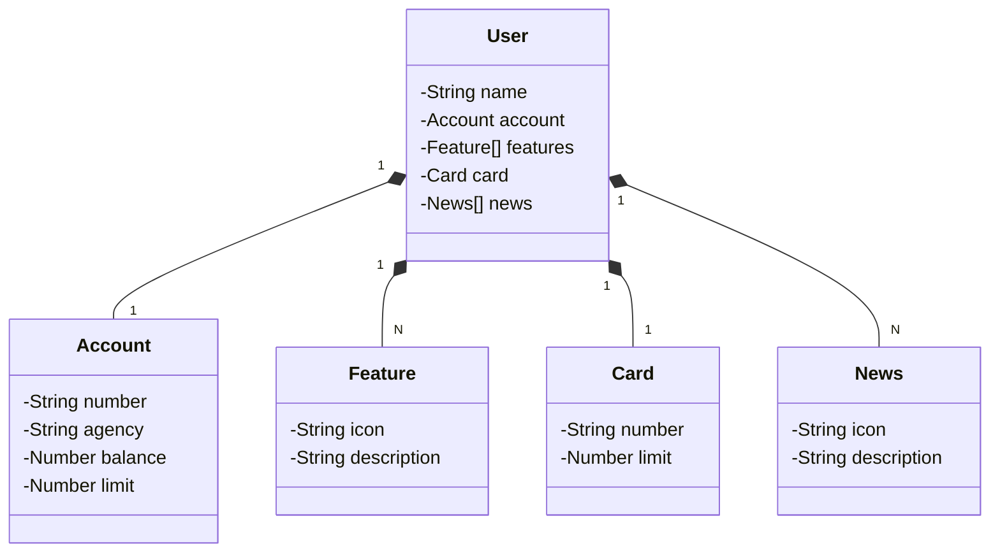

# API_java

  

Este projeto consiste em uma API Java para gerenciar usuários, contas, recursos, cartões e notícias. Ele fornece funcionalidades básicas para criar, visualizar e modificar essas entidades.

  

## Objetivo

  

O objetivo desta API é fornecer uma estrutura simples e flexível para aplicações que precisam de funcionalidades de gerenciamento de usuários e contas. Ele permite que os desenvolvedores integrem facilmente recursos como criação de usuários, atribuição de recursos, gerenciamento de contas e notificação de notícias.

  

## Funcionalidades Principais
  
* Usuários: Permite criar usuários com um nome único.

* Contas: Cada usuário pode ter uma conta associada, contendo número, agência, saldo e limite.

* Recursos: Os usuários podem ter vários recursos associados, como funcionalidades específicas do sistema.

* Cartões: Cada usuário pode ter um cartão associado, contendo número e limite.

* Notícias: Os usuários podem receber notícias associadas à sua conta.

## Diagrama de Classes (Domínio da API)

  

